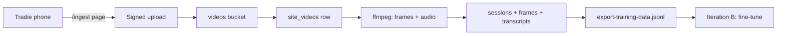

# Site video ingest → database → training export

Tradie uploads job videos from site. Foreman stores them in Supabase, extracts frames + audio into normal `sessions` / `frames` / `transcript_segments` rows, then `export-training-data` feeds Iteration B training.

## Recommended setup (primary)

**Supabase Storage + mobile upload page** — not Google Drive as the source of truth.

| Why | Detail |
|-----|--------|
| Data stays in the moat | Videos land in your `videos` bucket, same project as frames |
| Simple for tradie | Open a link on iPhone, pick video from camera roll, tap upload |
| No Vercel size limit | Browser uploads direct to Supabase via signed URL |
| Same pipeline as live coach | Imported rows look like a finished session |

**Tradie bookmark URL:** **https://foreman-phi.vercel.app/ingest**

On iPhone Safari: open the URL → Share → **Add to Home Screen** → name it “Foreman upload”.
The tradie taps that icon after a job, picks a video from the camera roll, and uploads.

## One-time setup

### 1. Supabase migration

In the [SQL editor](https://supabase.com/dashboard/project/uvlgbsiwyvtsjlqzozas/sql/new), run
`backend/supabase/site-videos-ingest.sql` (after `schema.sql` + `training-iteration-a.sql` —
see [scripts/apply-migrations.md](scripts/apply-migrations.md) for the full order + verification).

Creates `site_videos` table and private `videos` bucket (500 MB per file).

### 2. Render env (API)

Add to https://dashboard.render.com (foreman-api service):

```env
INGEST_WEBHOOK_SECRET=<random 32+ chars>
INGEST_FRAME_INTERVAL_SEC=10
INGEST_MAX_FRAMES=60
INGEST_ANALYSE_FRAMES=false
```

`INGEST_ANALYSE_FRAMES=true` runs Claude on every extracted frame (slow + costly). Leave `false` for pilot; training export still gets frames + Whisper transcript.

### 3. Video processing host (ffmpeg)

Render does **not** ship ffmpeg. Processing runs on a machine that has ffmpeg:

```bash
brew install ffmpeg   # Mac
cd backend && npm run process-videos
```

Or nightly:

```bash
./scripts/training-pipeline.sh
```

That script processes pending videos, then exports JSONL for training.

**Cron example** (Mac, 11pm daily):

```cron
0 23 * * * cd /path/to/FOREMAN && ./scripts/training-pipeline.sh >> /tmp/foreman-training.log 2>&1
```

**Remote cron** without local Mac: hit Render with webhook secret:

```bash
curl -X POST https://foreman-api-y31r.onrender.com/ingest/process-pending \
  -H "x-ingest-webhook-secret: YOUR_INGEST_WEBHOOK_SECRET"
```

Only works if that Render instance has ffmpeg (paid/custom image). Default free tier: run `process-videos` locally.

## Flow



1. **Init** — `POST /ingest/videos/init` → signed Supabase URL + `videoId`
2. **Upload** — browser `PUT` video to signed URL (direct to Supabase)
3. **Complete** — `POST /ingest/videos/:id/complete` → queue processing
4. **Process** — ffmpeg extracts audio (Whisper), frames every 10s → `persistFrame`
5. **Export** — `npm run export-training` or `training-pipeline.sh`

## Optional: Google Drive folder

Use only if the tradie already lives in Drive. Drive has no native webhooks; use Apps Script on a timer.

1. Create shared folder **Foreman Site Videos**
2. [Apps Script](https://script.google.com) → paste `scripts/google-drive-apps-script.gs`
3. Script properties:
   - `DRIVE_FOLDER_ID` — folder ID from URL
   - `FOREMAN_WEBHOOK_URL` — `https://foreman-api-y31r.onrender.com/ingest/drive-webhook`
   - `FOREMAN_INGEST_SECRET` — same as `INGEST_WEBHOOK_SECRET` on Render
4. Trigger: time-driven, every 10 minutes → `syncDriveFolder`

Drive files are copied into Supabase, then same processing path as phone upload.

## Status check

```bash
curl -H "x-foreman-api-key: $FOREMAN_API_KEY" \
  https://foreman-api-y31r.onrender.com/ingest/videos/<videoId>
```

## Training (what “auto train” means today)

| Step | Automated? | Command |
|------|------------|---------|
| Ingest + DB rows | Yes (after ffmpeg step) | upload page or Drive sync |
| Export JSONL | Yes | `npm run export-training` |
| Whisper / VLM fine-tune | **No** (Iteration B) | see `TRAINING_ROADMAP.md` |

Pseudo-labels from import are fine for export; human verification before fine-tune is still required per roadmap.

## Troubleshooting

| Symptom | Fix |
|---------|-----|
| `Supabase is not configured` | `SUPABASE_*` on Render |
| `site_videos` relation missing | Run SQL migration |
| Status `failed` — ffmpeg | Run `npm run process-videos` locally |
| Upload 413 on old path | Use `/ingest` page (signed URL), not posting video to API |
| Drive sync 401 | Match `INGEST_WEBHOOK_SECRET` in Apps Script + Render |
