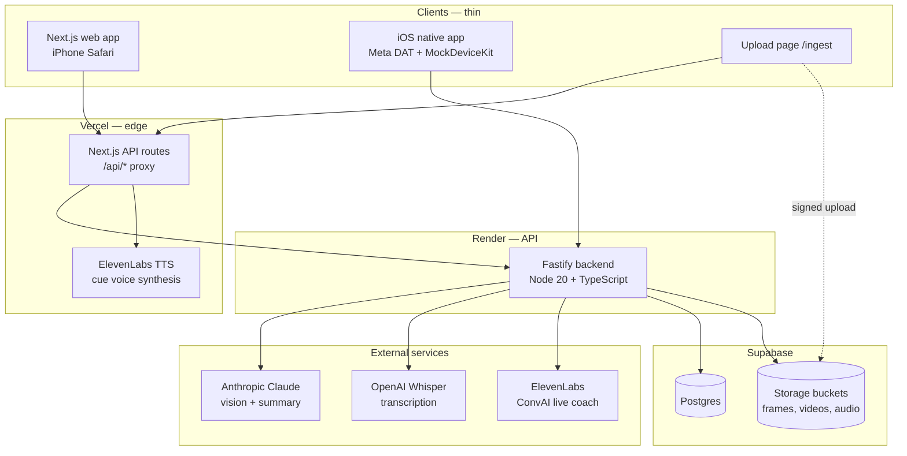
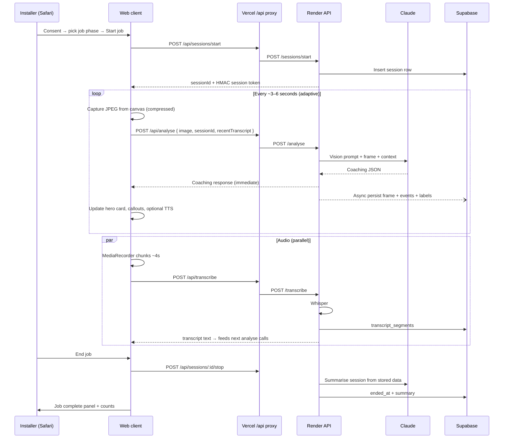
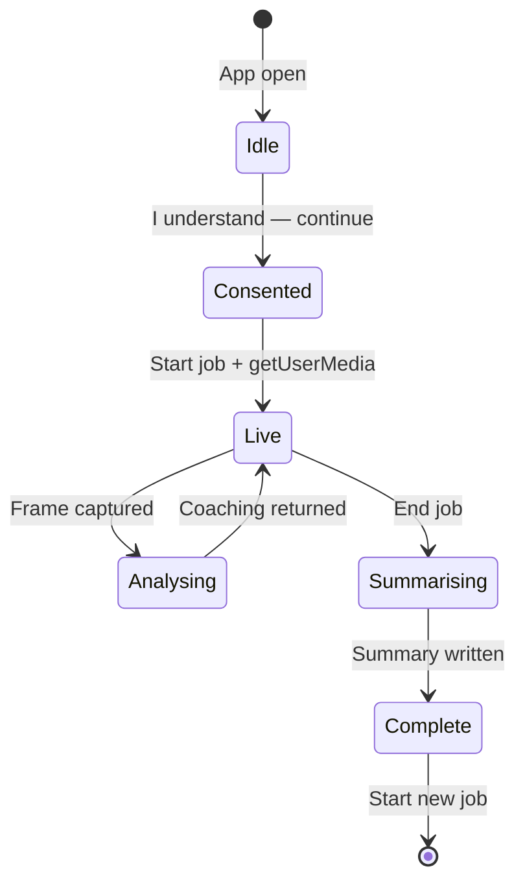
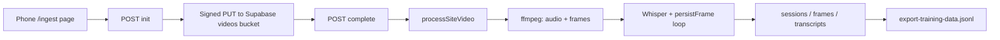

# Foreman — Technical Overview

**Version:** June 2026  
**Production:** [foreman-phi.vercel.app](https://foreman-phi.vercel.app) (web) · [foreman-api-y31r.onrender.com](https://foreman-api-y31r.onrender.com) (API)  
**Repository:** [github.com/mattsmith720/FOREMAN](https://github.com/mattsmith720/FOREMAN)

---

## 1. What Foreman is

Foreman is an **AI coaching layer for field work teams**, starting with **solar installers in Australia**. A camera and microphone watch the job as it happens. The system delivers **real-time structured coaching** (install quality, safety, sales pitch, pacing) and **automatically logs the entire job** — frames, transcripts, coaching events, and labels — to a central database.

The product thesis: **the data is the moat, not the code.** Every job Foreman observes becomes proprietary training data that makes the system sharper over time. Clients (phone browser today, Meta smart glasses later) are thin and interchangeable; the analysis engine, schema, and dataset live in the backend.

### Primary use cases

| Mode | Who | What happens |
|------|-----|----------------|
| **Live coaching** | Installer on site | Phone camera + mic → Claude vision analysis every few seconds → coaching card + optional voice |
| **Job logging** | Same session | Every analysed frame persisted to Supabase with coaching JSON, events, and pseudo-labels |
| **Pitch critique** | Door-knock / customer conversation | Whisper transcription fed into Claude; sales feedback in coaching output |
| **Offline video ingest** | Tradie after a job | Upload site video → ffmpeg extracts frames + audio → same session schema → training export |
| **End-of-job summary** | Installer or manager | Claude-generated summary from stored frames + transcripts |

---

## 2. Why the architecture is built this way

### Thin clients, fat backend

- **Clients never hold AI API keys.** All Claude, Whisper, and ElevenLabs calls run server-side.
- **One coaching schema** (`@foreman/shared`, Zod-validated) is shared across backend, web, and native iOS so the contract cannot drift.
- **One capture seam** (`FrameSource` interface) lets the frame source swap from phone web camera → Meta glasses without changing the pipeline.

### Agile, iteration-based delivery

The system is built in **demoable iterations** — each ships something runnable before the next layer (sessions, audio, glasses, training loop). See [CLAUDE.md](CLAUDE.md) for the canonical roadmap.

### Australian pilot constraints

- Consent overlay before any camera/mic access (AU privacy wording).
- Private Supabase storage; RLS on all tables; service role backend-only.
- Australian English in model prompts; ElevenLabs “Charlie” voice for spoken cues.

---

## 3. High-level system architecture



### Production topology

| Layer | Host | Role |
|-------|------|------|
| **Web UI** | Vercel | Next.js 14 App Router; camera coach, ingest page, server-side API proxy |
| **API** | Render (free tier, Oregon) | Fastify HTTP API; AI orchestration; persistence |
| **Database + files** | Supabase (Sydney region project) | Postgres + private object storage |
| **Vision + text AI** | Anthropic API | Claude Sonnet 4 — frame analysis, session summaries, voice advice |
| **Speech-to-text** | OpenAI API | Whisper — mic chunks and imported video audio |
| **Voice output** | ElevenLabs | TTS on Vercel; ConvAI signed URLs on Render |

The browser talks **same-origin** to Vercel (`NEXT_PUBLIC_API_URL=same-origin`). Vercel route handlers forward to Render with `FOREMAN_API_KEY`. This keeps secrets off the client and avoids CORS complexity on the phone.

---

## 4. Repository structure

npm workspaces monorepo (Node 18.18+, Node 20 recommended):

```
foreman/
├── shared/           @foreman/shared — Zod coaching schema + FrameSource interface
├── backend/          Fastify API, AI calls, Supabase persistence, ingest processing
├── web/              Next.js 14 phone prototype + Vercel API proxy routes
├── native/ios/       Swift iOS — Meta Wearables DAT (glasses path, Iteration 4+)
├── scripts/          check-ready, smoke E2E, training pipeline, Drive sync
└── backend/supabase/ SQL migrations (schema, training, site videos)
```

| Package | Stack | Deploy target |
|---------|-------|---------------|
| `shared` | TypeScript, Zod | Built at `postinstall`; imported by backend + web |
| `backend` | Fastify 5, Anthropic SDK, Supabase JS | Render (`render.yaml`) |
| `web` | Next.js 14, React 18 | Vercel |
| `native/ios` | Swift, Meta DAT 0.7, XcodeGen | TestFlight / internal (not App Store yet) |

---

## 5. Core runtime: live coaching pipeline

This is the main loop an installer experiences on site.



### Frame capture (`PhoneFrameSource`)

Implements `FrameSource` from `@foreman/shared`:

- `getUserMedia` — rear camera (`facingMode: environment`), optional mic on same stream.
- Samples on an interval (default 6s) with **adaptive `captureNow()`** after each analyse completes (min gap ~2.8s) so slow networks do not build a frame backlog.
- Frames compressed client-side (`compress-frame.ts`) — max dimension 384px, JPEG quality ~0.45 — to stay under Vercel’s ~4.5MB serverless body limit.

### Audio capture (`PhoneAudioSource`)

- `MediaRecorder` on audio-only stream; prefers `audio/mp4` on iOS Safari, falls back to WebM.
- ~4 second chunks → `/transcribe` → transcript lines shown in UI and sent as `recentTranscript` on subsequent `/analyse` calls (avoids extra DB round-trips).

### Job phases

Before starting, the worker picks a phase: **Survey**, **Install**, or **Pitch** (`site_survey` | `solar_install` | `customer_pitch`). This flows to `sessions.job_type` and biases coaching (e.g. pitch feedback prioritised in customer_pitch mode).

### Coaching output schema

Every analysed frame returns validated JSON (`coachingResponseSchema` in `shared/src/coaching.ts`):

| Field | Purpose |
|-------|---------|
| `observations` | Short reads of what is happening |
| `installQualityFlags` | Workmanship / compliance issues with severity |
| `salesPitchFeedback` | Door-knock and customer conversation coaching |
| `timeOnTaskNote` | Pacing note |
| `nextSteps` | 1–3 immediate actions |
| `visualCallouts` | Normalised x/y regions for on-screen circles/boxes |

Severity: `info` | `warning` | `critical`. Categories for events: `pitch` | `quality` | `time` | `safety`.

### Analysis prompt

Solar-specific system prompt in `backend/src/prompts/analysis.ts` — roof safety, rail/bracket layout, DC routing, inverter placement, site tidiness, and Australian sales conversation critique when transcript is present. Model default: `claude-sonnet-4-20250514`; `ANTHROPIC_MAX_TOKENS` default 512 for faster JSON responses.

### Persistence (async)

`/analyse` returns coaching **immediately**; `persistFrame` runs fire-and-forget:

1. Upload JPEG to private `frames` bucket (`{sessionId}/{frameId}.jpeg`).
2. Insert `frames` row with `analysis` JSONB.
3. Derive `coaching_events` and `labels` (pseudo-labels, `label_source: claude` when Iteration A migration applied).
4. Parallel inserts via `Promise.all`.

---

## 6. Session lifecycle and security tokens



| Step | Endpoint | Auth |
|------|----------|------|
| Start | `POST /sessions/start` | `x-foreman-api-key` |
| Analyse | `POST /analyse` | API key + `x-session-token` (HMAC of session UUID) |
| Transcribe | `POST /transcribe` | API key + session token |
| Stop | `POST /sessions/:id/stop` | API key + session token |
| Get session | `GET /sessions/:id` | API key + session token |

**Session token:** HMAC-SHA256 of `sessionId` using `SESSION_TOKEN_SECRET` (defaults to `FOREMAN_API_KEY`). Issued at session start; required for all session-scoped mutations. Prevents arbitrary clients from writing to another job’s session if they guess a UUID.

**No user login yet** — session UUID + token is the access model for the pilot. Production also requires `FOREMAN_API_KEY` on every non-public route.

Public routes (no API key): `/health`, `/ready`, `/ingest/drive-webhook`, `/ingest/process-pending` (webhook secret instead).

---

## 7. Voice stack

| Feature | Path | Where it runs |
|---------|------|----------------|
| **Cue TTS** | Critical/warning coaching lines spoken aloud | Vercel (`web/lib/elevenlabs-tts.ts`) — Render datacenter IPs blocked by ElevenLabs for TTS |
| **Ask Foreman** | Hold-to-talk → Claude advice → spoken reply | Render `/voice/advice` + Vercel TTS for audio |
| **Live ConvAI** | Two-way ElevenLabs agent WebSocket | Render `/voice/convai-url` signed URL; optional `ELEVENLABS_AGENT_ID` |

Default voice: **Charlie** (Australian male), `ELEVENLABS_VOICE_ID=IKne3meq5aSn9XLyUdCD`.

---

## 8. Data model (Supabase / Postgres)

### Core tables (`backend/supabase/schema.sql`)

| Table | Purpose |
|-------|---------|
| `sessions` | Job record: worker, job_type, notes, summary, started_at, ended_at |
| `frames` | One row per analysed frame; `storage_ref` + `analysis` JSONB |
| `transcript_segments` | Whisper output chunks with timestamp and speaker |
| `coaching_events` | Normalised cues (category, severity, message) per session |
| `labels` | Key/value training labels derived from coaching (pseudo-labels from Claude) |

All tables: **RLS enabled, no public policies** — only `service_role` backend access.

### Storage buckets

| Bucket | Content | Access |
|--------|---------|--------|
| `frames` | JPEG frame images | Private; explicit deny policies for `public` role |
| `videos` | Raw site video uploads (ingest) | Private; up to 500MB per file |
| `audio` | Raw audio segments (Iteration A) | Private |

### Training foundation migration (`training-iteration-a.sql`)

Adds:

- `labels.label_source` — `claude` | `human` | `corrected`
- `labels.frame_id`, `labels.confirmed_at`
- `frames.transcript_window` — alignment for export
- `sessions.consent_at`, `sessions.data_retention` (default `pilot_90d`)
- `audio_segments` table + `audio` bucket

### Site video ingest (`site-videos-ingest.sql`)

Adds `site_videos` queue table tracking upload/processing status for offline video imports.

> **Operator note:** Apply migrations in order via Supabase SQL editor: `schema.sql` → `training-iteration-a.sql` → `site-videos-ingest.sql`.

---

## 9. HTTP API reference

Base URL (production): `https://foreman-api-y31r.onrender.com`  
Web proxy: `https://foreman-phi.vercel.app/api/*`

### Health

| Method | Path | Description |
|--------|------|-------------|
| GET | `/health` | Liveness — process up |
| GET | `/ready` | Feature flags: anthropic, openai, supabase, transcription, elevenlabs |

### Sessions

| Method | Path | Body | Response |
|--------|------|------|----------|
| POST | `/sessions/start` | `{ worker?, jobType?, notes? }` | `{ session, token }` |
| POST | `/sessions/:id/stop` | — | `{ session, stored: { frames, events, labels, transcripts } }` |
| GET | `/sessions/:id` | — | Session row + counts |

### Analysis

| Method | Path | Body | Notes |
|--------|------|------|-------|
| POST | `/analyse` | `{ image, sessionId?, recentTranscript?, context? }` | Rate limit 20/min/IP; image magic-byte validation |

### Transcription

| Method | Path | Body | Notes |
|--------|------|------|-------|
| POST | `/transcribe` | `{ audio: base64, mimeType, sessionId? }` | Rate limit 30/min/IP; Whisper |

### Voice

| Method | Path | Description |
|--------|------|-------------|
| GET | `/voice/config` | TTS/live availability flags |
| POST | `/voice/speak` | ElevenLabs TTS (Render; may 503 from datacenter) |
| POST | `/voice/advice` | Claude Q&A for hold-to-talk coach |
| GET | `/voice/convai-url` | Signed WebSocket URL for live agent |

### Labels (training moat)

| Method | Path | Description |
|--------|------|-------------|
| POST | `/labels/confirm` | Confirm or correct a label (`label_source: human` / `corrected`) |

### Ingest (site videos)

| Method | Path | Description |
|--------|------|-------------|
| POST | `/ingest/videos/init` | Create row + signed Supabase upload URL |
| POST | `/ingest/videos/:id/complete` | Queue processing |
| GET | `/ingest/videos/:id` | Status poll |
| POST | `/ingest/drive-webhook` | Google Drive Apps Script sync (webhook secret) |
| POST | `/ingest/process-pending` | Batch process pending videos (webhook secret; needs ffmpeg) |

### Web proxy routes (`web/app/api/`)

Mirror backend paths: `analyse`, `transcribe`, `sessions/start`, `sessions/[id]/stop`, `sessions/[id]`, `voice/*`, `health`, `ingest/*`.

---

## 10. Site video ingest pipeline

For tradies who record on site and upload later (bypasses live latency; fills training dataset fast).



**Processing** (`backend/src/process-site-video.ts`):

- Requires **ffmpeg** on the processing host (not available on Render free tier by default — run locally or on a cron machine).
- Creates a normal `sessions` row, extracts audio → Whisper, samples frames every 10s (configurable), optionally runs Claude per frame (`INGEST_ANALYSE_FRAMES=true`, costly).
- Marks session `ended_at` so export includes it.

**Optional Google Drive path:** Apps Script (`scripts/google-drive-apps-script.gs`) polls a shared folder and POSTs to `/ingest/drive-webhook`.

See [SITE_VIDEO_INGEST.md](SITE_VIDEO_INGEST.md) for operator setup.

---

## 11. Training data and the moat strategy

Foreman accumulates structured job data for future model improvement. See [TRAINING_ROADMAP.md](TRAINING_ROADMAP.md).

| Stage | Status | What it delivers |
|-------|--------|------------------|
| **Iteration 0–1** | Shipped | Live coaching + Supabase logging |
| **Iteration A** | Schema ready | Label provenance, audio storage, consent metadata, export script |
| **Iteration B** | Planned | Scheduled exports, train/val split by session, Whisper fine-tune on solar vocabulary |
| **Iteration C** | Planned | Distilled local vision coach, hybrid inference, continual retrain on human-verified sessions |

**Export:**

```bash
cd backend && npx tsx scripts/export-training-data.ts --out ./exports/dataset.jsonl --limit 50
```

Output: JSONL with signed frame URLs, analysis JSON, labels, transcript windows, session metadata.

**Critical principle:** Claude-generated pseudo-labels alone are not the moat. **Human-verified corrections** on real jobs are the asset. `POST /labels/confirm` exists; a lightweight post-job review UI is on the roadmap.

**Full batch pipeline:**

```bash
./scripts/training-pipeline.sh   # process pending videos + export
```

---

## 12. Security architecture

| Control | Implementation |
|---------|----------------|
| API authentication | `x-foreman-api-key` — timing-safe compare; required in production boot |
| Session scoping | HMAC `x-session-token` per session |
| CORS | Explicit `CORS_ORIGINS` — wildcard rejected at boot |
| Rate limiting | Global 120/min/IP; tighter on AI routes |
| Input validation | Zod on all bodies; image magic bytes; audio MIME allowlist |
| Secrets | Never in client bundles; gitleaks CI on every push |
| Vercel proxy gate | `middleware.ts` — Origin/Referer must match `ALLOWED_APP_ORIGINS` or `*.vercel.app` preview |
| Storage | Private buckets; RLS on tables; service_role backend only |
| Error handling | Generic client messages; details server-side only |

Full audit: [SECURITY.md](SECURITY.md).

---

## 13. Native iOS path (Meta smart glasses)

**Status:** Skeleton + MockDeviceKit integration (Iteration 4). Not required for phone browser pilot.

Meta Wearables Device Access Toolkit constraints (hard facts):

- Third-party code runs on the **paired phone**, not on the glasses.
- Glasses are capture devices only; media streams to the phone app in real time.
- **MockDeviceKit** uses the phone back camera as a simulated glasses feed for development.
- Public App Store publishing is gated during developer preview; internal org testing is allowed.
- No custom “Hey Meta” commands — standard pause/resume/stop events only.
- Foreman brings its own AI (Claude) in the cloud.

The iOS app calls the **same Render API** — no backend changes when swapping mock → real glasses. Switch: `FOREMAN_USE_MOCK_DEVICE` in Xcode config.

See [native/ios/README.md](native/ios/README.md).

---

## 14. Deployment and operations

### Render (API)

- Blueprint: `render.yaml`
- Build: `npm ci && npm run build:shared && npm run build --workspace backend`
- Start: `npm run start --workspace backend`
- Health check: `/health`
- Free tier cold start: first request after ~15 min idle may take 30–60s

### Vercel (web)

- Root: `web/`; monorepo install from parent
- Env: `BACKEND_URL`, `FOREMAN_API_KEY`, `ALLOWED_APP_ORIGINS`, `ELEVENLABS_API_KEY` (TTS), `NEXT_PUBLIC_API_URL=same-origin`

### Verification scripts

```bash
npm run check-ready   # local keys + unit tests + production probes
npm run smoke         # E2E: session → analyse → transcribe → stop
```

### Key environment variables

| Variable | Where | Purpose |
|----------|-------|---------|
| `ANTHROPIC_API_KEY` | Render | Claude vision + summaries |
| `OPENAI_API_KEY` | Render | Whisper |
| `SUPABASE_URL` + `SUPABASE_SERVICE_ROLE_KEY` | Render | Postgres + storage |
| `FOREMAN_API_KEY` | Render + Vercel | API auth |
| `CORS_ORIGINS` | Render | Allowed browser origins |
| `BACKEND_URL` | Vercel | Proxy target |
| `ELEVENLABS_API_KEY` | Vercel (+ Render for ConvAI) | Voice |
| `INGEST_WEBHOOK_SECRET` | Render | Drive sync + batch process webhook |

Never commit `.env` files. Template: `backend/.env.example`.

---

## 15. Development workflow

```bash
npm install                    # workspaces + build shared
cp backend/.env.example backend/.env
npm run dev:backend            # localhost:8080
npm run dev:web                # localhost:3000
npm run dev:phone              # HTTPS on LAN for iPhone testing
npm run build                  # full monorepo build
cd backend && npm test         # 36+ Fastify route/unit tests
cd web && npm test             # middleware, consent, compression tests
```

### Testing philosophy

- Zod schema test for coaching parser (`parse-coaching.test.ts`)
- Route integration tests with mocked AI providers
- Rate-limit tests prove 429 at cap+1
- Production boot guard tests (missing `FOREMAN_API_KEY` / `CORS_ORIGINS` → exit)
- Consent gate tests (no `getUserMedia` before consent)

---

## 16. Roadmap and current iteration status

Per [CLAUDE.md](CLAUDE.md):

| Iteration | Goal | Status |
|-----------|------|--------|
| **0** | Backend `/analyse` endpoint | ✅ Complete |
| **1** | Phone web client, live coaching | ✅ Complete (production) |
| **2** | Sessions, Supabase logging, solar coaching, end-of-job summary | ✅ Complete |
| **3** | Audio capture, transcription, pitch critique | ✅ Complete |
| **4** | Native app + Meta MockDeviceKit | 🔧 Skeleton; not pilot-critical |
| **5** | Real Meta glasses | ⏸️ Blocked on hardware + DAT preview access |

**Beyond roadmap (in codebase):**

- ICP-focused HUD (hero card, Details sheet, job phase picker)
- Performance: async persist, adaptive capture, smaller JPEGs
- Site video ingest + training export pipeline
- Iteration A training schema (migration SQL ready)

---

## 17. Known limitations (pilot)

| Area | Limitation |
|------|------------|
| **Auth** | No per-user accounts; session token model only |
| **Render** | Free tier sleep + no ffmpeg (video processing runs elsewhere) |
| **Latency** | Claude round-trip ~2–8s per frame; adaptive capture prevents backlog |
| **Labels** | Mostly Claude pseudo-labels; human review UI minimal |
| **Legal** | Consent overlay implemented; formal AU privacy review before customer pilot |
| **Training** | Export works; automated fine-tune loop not yet deployed |

---

## 18. Related documentation

| Document | Audience |
|----------|----------|
| [CLAUDE.md](CLAUDE.md) | Builders — mission, conventions, iteration rules |
| [README.md](README.md) | Quick start |
| [DEPLOY.md](DEPLOY.md) | Production deploy steps |
| [SECURITY.md](SECURITY.md) | Security controls and env checklist |
| [PHONE_DEMO.md](PHONE_DEMO.md) | 90-second demo script |
| [SITE_VIDEO_INGEST.md](SITE_VIDEO_INGEST.md) | Offline video → training data |
| [TRAINING_ROADMAP.md](TRAINING_ROADMAP.md) | Data moat and ML iterations |
| [ELEVENLABS_VOICE.md](ELEVENLABS_VOICE.md) | Voice setup |
| [native/ios/README.md](native/ios/README.md) | Glasses / Meta DAT path |

---

## 19. One-paragraph summary for external readers

Foreman is a production-deployed AI coaching system for solar field teams. Installers open a web app on their iPhone, consent to recording, and receive real-time vision-based coaching from Claude while Whisper transcribes on-site conversation. Every frame, transcript, and coaching event is stored in Supabase as proprietary training data. The architecture deliberately keeps clients thin (browser today, Meta glasses tomorrow) and concentrates IP in a typed Node.js backend with a shared Zod coaching schema. Voice feedback uses ElevenLabs; the API runs on Render behind a Vercel same-origin proxy with API-key and session-token security. Offline site videos can be ingested for batch labelling and export to JSONL for future model fine-tuning. The moat is the accumulated, eventually human-verified dataset from real jobs — not the application code alone.

---

*For questions about integration, pilot access, or partnership, refer to the repository maintainer. Do not share API keys, service role tokens, or webhook secrets in documentation or email.*
